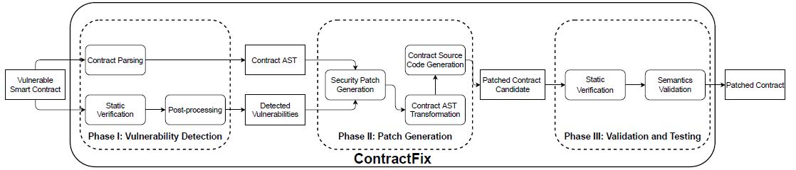

# ContractFix

## Introduction

Blockchain allows mutually untrusted parties to run a consensus protocol to agree on the trading 
transactions and maintain a shared ledger of data. While the correct execution of smart contracts is
enforced by the consensus protocol of blockchain, it is challenging to create smart contracts that 
are free of security vulnerabilities. <br>

ContractFix is a novel framework that automatically generates source code patched for vulnerable smart
contracts. ContractFix can incorporate different fix strategies for smart contract vulnerabilities, and
is designed to be a security "fix-it" tool that can automatically apply patches to the vulnerabilities
and verify the patched contracts before the contract deployment.

## Setup
<ol>
<li> Install the Secueify: https://github.com/eth-sri/securify
<li> Install the Slither: https://github.com/crytic/slither
<li> Install the Smartcheck: https://github.com/smartdec/smartcheck
<li> Install the required packages listed in the package-lock.json
</ol>

## Input
<ol>
<li> The vulnerable smart contract
<li> processed the static tools' report
</ol>

## Output

The patched contract

## How to use
1. use Securify, Slither, and Smartcheck to find potential vulnerabilities
2. combine these three reports
3. use this combined static verification tools' results and contract as inputs for ContractFix
```bash
node top.js static-verification-reports-path smart-contract-path output-path
```

## Example

In the folder example, we provide some contracts with vulnerabilities, which can be used as the
input for the ContractFix. We also give the ContractFix patched contract which can
be used for users to verify the output of the installed ContractFix.

## Result

In the folder res, we upload the original data shown in our submission. The readme in the corresponding res
folder simply summarize our results. For more detailed explanation, please check our submission.